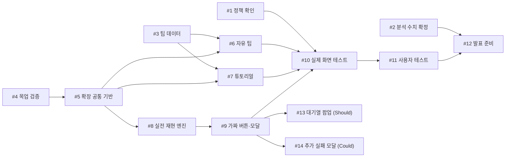

# AI 협업 기록 / AI Collaboration Log

작성 원칙: 프롬프트 나열이 아니라 **판단 근거**를 남긴다.
Principle: record your **reasoning**, not just prompts.
---

## [이슈 #1] 메모 검색 기능 (2주차 활동)

**목표(스펙) / Spec**
- 입력 Input: GET /memos/search?q={키워드} — 쿼리 파라미터 q (문자열)
- 처리 Processing: req.user.id 기준으로 본인 소유 메모 중 title 또는 body에 q가 포함된 메모를 조회. LIKE 검색 시 특수문자(%, _)는 escapeLikePattern()으로 이스케이프 처리
- 출력 Output: { ok: true, data: [메모 목록] } — 목록 항목은 기존 조회 API와 동일하게 id, title, created_at 포함
- 실패 조건 Failure: q가 없거나 빈 문자열이면 400과 함께 { ok: false, error: 'QUERY_REQUIRED' } 반환 (에러 코드는 CONVENTIONS.md 명명 규칙에 맞춰 대문자+밑줄)

**요청한 프롬프트 요지 / Prompt (summary)**

A조 프롬프트
``` markdown
메모 검색 기능 만들어줘. 제목이랑 본문에서 키워드로 찾을 수 있게.
```
B조 프롬프트
```` markdown
[지시]
메모 검색 기능을 추가해줘. 제목과 본문에서 키워드로 검색된다.

[규약]
(CONVENTIONS.md 내용 전체를 붙여넣기)
# 프로젝트 규약

이 문서는 코드를 작성할 때 지켜야 할 규칙입니다.

## 계층 분리

- `routes.js`는 HTTP 요청과 응답만 다룹니다. SQL을 직접 쓰지 않습니다.
- 데이터베이스 접근은 `service.js`에만 둡니다.

## 응답 형식

모든 응답은 다음 두 형태 중 하나입니다.

```json
{ "ok": true,  "data": ... }
{ "ok": false, "error": "ERROR_CODE" }
```

에러 코드는 대문자와 밑줄로 씁니다. (예: `MEMO_NOT_FOUND`)

## 명명 규칙

- 함수명은 동사로 시작합니다. `list`, `get`, `create`, `update`, `remove`
- 데이터베이스 컬럼은 스네이크 케이스를 씁니다. `user_id`, `created_at`
- 자바스크립트 변수는 카멜 케이스를 씁니다. `userId`, `createdAt`

## 입력 검증

- 사용자 입력은 반드시 검증합니다.
- 검증에 실패하면 400과 함께 `{ ok: false, error }` 를 반환합니다.

## 권한

- 모든 조회와 수정은 **본인 소유 데이터로 한정**합니다.
- 모든 쿼리에 `user_id` 조건을 포함합니다.


[근거]
(schema.sql, service.js, routes.js 내용 전체를 붙여넣기)
//schema.sql
# 프로젝트 규약

이 문서는 코드를 작성할 때 지켜야 할 규칙입니다.

## 계층 분리

- `routes.js`는 HTTP 요청과 응답만 다룹니다. SQL을 직접 쓰지 않습니다.
- 데이터베이스 접근은 `service.js`에만 둡니다.

## 응답 형식

모든 응답은 다음 두 형태 중 하나입니다.

```json
{ "ok": true,  "data": ... }
{ "ok": false, "error": "ERROR_CODE" }
```

에러 코드는 대문자와 밑줄로 씁니다. (예: `MEMO_NOT_FOUND`)

## 명명 규칙

- 함수명은 동사로 시작합니다. `list`, `get`, `create`, `update`, `remove`
- 데이터베이스 컬럼은 스네이크 케이스를 씁니다. `user_id`, `created_at`
- 자바스크립트 변수는 카멜 케이스를 씁니다. `userId`, `createdAt`

## 입력 검증

- 사용자 입력은 반드시 검증합니다.
- 검증에 실패하면 400과 함께 `{ ok: false, error }` 를 반환합니다.

## 권한

- 모든 조회와 수정은 **본인 소유 데이터로 한정**합니다.
- 모든 쿼리에 `user_id` 조건을 포함합니다.
``` javascript
//service.js
const db = require('./db');

/**
 * 사용자의 메모 목록을 최신순으로 조회한다.
 */
function listMemos(userId) {
  return db.all(
    `SELECT id, title, created_at
       FROM memos
      WHERE user_id = ?
      ORDER BY created_at DESC`,
    [userId]
  );
}

/**
 * 메모 한 건을 조회한다. 본인 메모가 아니면 null을 반환한다.
 */
function getMemo(userId, memoId) {
  return db.get(
    `SELECT id, title, body, created_at
       FROM memos
      WHERE id = ? AND user_id = ?`,
    [memoId, userId]
  );
}

/**
 * 메모를 생성한다.
 */
function createMemo(userId, title, body) {
  return db.run(
    `INSERT INTO memos (user_id, title, body, created_at)
     VALUES (?, ?, ?, datetime('now'))`,
    [userId, title, body]
  );
}

module.exports = { listMemos, getMemo, createMemo };
//routes.js
const express = require('express');
const service = require('./service');

const router = express.Router();

// 메모 목록 조회
router.get('/memos', async (req, res) => {
  const memos = await service.listMemos(req.user.id);
  res.json({ ok: true, data: memos });
});

// 메모 단건 조회
router.get('/memos/:id', async (req, res) => {
  const memo = await service.getMemo(req.user.id, req.params.id);

  if (!memo) {
    return res.status(404).json({ ok: false, error: 'MEMO_NOT_FOUND' });
  }

  res.json({ ok: true, data: memo });
});

// 메모 생성
router.post('/memos', async (req, res) => {
  const { title, body } = req.body;

  if (!title || !body) {
    return res.status(400).json({ ok: false, error: 'TITLE_AND_BODY_REQUIRED' });
  }

  const result = await service.createMemo(req.user.id, title, body);
  res.status(201).json({ ok: true, data: { id: result.lastID } });
});

module.exports = router;
```
[종료조건]
- GET /memos/search?q=키워드 로 호출된다
- 제목 또는 본문에 키워드가 포함된 메모만 반환한다
- 본인 메모만 반환한다
- q가 비어 있으면 400과 { ok: false, error } 를 반환한다
````
**결과에 대한 판단 / Decisions**
- 채택한 부분과 이유 / Accepted, because: 새로운 함수 escapeLikePattern(), searchMemos()를 포함해 전부 채택
- 수정한 부분과 이유 / Changed, because: 없음
- 폐기한 부분과 이유 / Rejected, because: 없음

**검증 방법 / How it was verified**
- 제목에만 키워드가 있는 메모, 본문에만 있는 메모, 둘 다 없는 메모로 각각 검색해 결과 포함 여부 확인
- 다른 사용자의 메모가 검색 결과에 노출되지 않는지 확인 (권한 스코프 검증)
- q 파라미터 누락/빈 문자열로 요청 시 400 + 지정된 에러 코드 반환 확인
- %, _ 등 LIKE 특수문자가 포함된 키워드로 검색해 escapeLikePattern()이 의도대로 이스케이프하는지 확인
- 응답 바디가 CONVENTIONS.md의 { ok, data } / { ok, error } 형식을 따르는지 확인
---

## [이슈 # 2] 3주차 활동

- 무엇을 하려고 썼는가

  아이디어 기획안 구체화하기 위해 사용
  
- 넣은 프롬프트 **원문 그대로** — 요약하지 않습니다

  신입생 튜토리얼 기획안을 작성하자. 신입생, 유학생 등 학교 시스템이 익숙하지 않은 사용자를 위해서 수강신청, 교수님께 이메일쓰는법, 강의실 찾아가기, 술자리에서 등 팁을 배울 수 있는 시뮬레이션을 만들면 좋을거 같아.

사용자 Who
상황 When/Where
페인포인트 What — 무엇이 얼마나
성공 기준 Done

이거 간단하게 작성해줘

- 나온 것 중 **쓴 것 / 버린 것**

  **who** 
  
  학교 시스템이 낯선 국내 신입생과 외국인 유학생
  
  **when/where** 
  
  입학 전 2월부터 개강 후 3주까지, 주로 모바일로 틈틈이 사용
  
  **what**
  
  • 수강신청 규칙을 몰라 원하는 과목을 놓침
  
  • 교수님께 보낼 이메일 형식을 몰라 한 통에 30분 이상 걸림
  
  • 건물 약칭과 호실 코드를 몰라 첫 주에 지각함
  
  • 술자리에서 거절하는 법을 몰라 원치 않는 음주를 함
  
  **done**
  
  • 시뮬레이션 완주율 70% 이상
  
  • 수강신청 관련 학사팀 문의 30% 감소
  
  • 개강 첫 주 "강의실 못 찾음" 응답이 미참여자의 절반 수준

- **버렸다면 왜 버렸는가** — 이 한 줄을 봅니다

  버리지않았음

- 무엇을 하려고 썼는가

  우리가 세운 가정의 사실 여부를 판단하는 조건을 세우기 위해 사용

- 넣은 프롬프트 **원문 그대로** — 요약하지 않습니다

  3	C	신입생은 학점 제한과 장바구니 규칙을 몰라서 원하는 과목을 놓친다	기존 데이터	학교 커뮤니티의 수강신청 실패 게시글 30개를 원인별로 분류	강준우	4주차
  4	C	교수님께 보내는 이메일 한 통에 30분 이상 걸린다	관찰	신입생 3명에게 결석 사유 메일을 실제로 쓰게 하고 소요 시간 측정	강준우	4주차
  5	C	건물 약칭과 호실 코드만 보고는 강의실을 찾기 어렵다	직접 해보기	가본 적 없는 건물의 강의실을 시간표 코드만 보고 찾아가며 시간과 헤맨 지점 기록	강준우	4주차
  
  내가 적은 가정 확인 계획인데, 아래 부분을 채워야해. 해당하는 내용이 있다면 작성해줘  
  관찰·데이터·직접 해보기를 한다면 / If you observe instead
  * 무엇을 셀 것인가 (숫자가 나와야 합니다):
  * 언제 어디서:

-  나온 것 중 **쓴 것 / 버린 것**

  **3번 (수강신청 실패 게시글)**
  
  - 가정이 맞다고 볼 조건: 30개 중 '학점 제한·장바구니 규칙 오해'가 원인인 글이 10개 이상(약 33% 이상)이거나, 원인별 순위에서 1~2위 안에 든다.
  - 가정이 틀렸다고 볼 조건: 5개 이하(약 17% 이하)이고, 서버 지연이나 정원 마감 같은 다른 원인이 훨씬 많다.
  - 기준 근거: 원인이 서너 가지로 나뉜다고 보면, 3분의 1 이상은 "주요 원인"이라고 말할 수 있는 수준이에요.
  
  **4번 (결석 사유 메일 작성)**
  
  - 가정이 맞다고 볼 조건: 3명 중 2명 이상이 30분을 넘긴다.
  - 가정이 틀렸다고 볼 조건: 3명 모두 20분 이내에 끝낸다.
  - 기준 근거: 가정 자체가 "30분 이상"이라서 그 숫자를 그대로 기준으로 썼어요. 3명이라 표본이 작으니, 과반(2명)이 넘으면 맞는 쪽으로 봅니다.
  
  **5번 (강의실 찾아가기)**
  
  - 가정이 맞다고 볼 조건: 찾아간 강의실 3곳 중 2곳 이상에서 입구부터 도착까지 10분을 넘기거나, 잘못 간 횟수가 2회 이상 나온다.
  - 가정이 틀렸다고 볼 조건: 모든 강의실에 5분 이내로 도착하고, 잘못 간 적이 없다.
  - 기준 근거: 쉬는 시간이 보통 10~15분이라, 건물 안에서만 10분이 걸리면 실제로 지각할 위험이 있다고 판단했어요.

- **버렸다면 왜 버렸는가** — 이 한 줄을 봅니다
  버리지않았음


---
(이슈 단위로 반복 / repeat per issue)

- 무엇을 하려고 썼는가

  정상경로와 실패경로의 케이스를 구하기 위해 사용

- 넣은 프롬프트 **원문 그대로** — 요약하지 않습니다

아래 예시를 참고해서 freshman simulater의 acceptance criteria를 작성해줘.
실패경로 포함.
성공기준은 다음과 같아. 참고해
"시뮬레이션 완주율 70% 이상	완주율
수강신청 관련 학사팀 문의 30% 감소	관련, 감소
개강 첫 주 "강의실 못 찾음" 응답이 미참여자의 절반 수준	응답, 절반 수준"

경로 Path	EARS 문장 Sentence	판정 방법 How to check
예시	정상	WHEN 학생이 과제 목록을 열면 THE 시스템은 SHALL 과목별 미제출 과제를 마감일 순으로 표시한다	미제출 과제 3건을 만든 뒤 목록을 열어 마감일 순으로 나오는지 확인

- 나온 것 중 **쓴 것 / 버린 것**

전체 다 활용하고 버리지않았다

- **버렸다면 왜 버렸는가** — 이 한 줄을 봅니다
  버리지않았음

## [이슈 #4] 5주차 활동

- 무엇을 하려고 썼는가

5주차 활동지 최신화하려고 사용

- 넣은 프롬프트 **원문 그대로** — 요약하지 않습니다

  "https://app.notion.com/p/3ee5c2546ced8160b28fec00c7072f50?source=copy_link
   얘를 최신화 해줘."

- 나온 것 중 **쓴 것 / 버린 것**

  - 작성일 / Date: 2026년 10월 5일 (2026년 10월 3일 버전 개정)
- 근거 자료
    - 학교 커뮤니티 수강신청 관련 게시글 1,466건 분석 (2025-11 ~ 2026-09, 원인 범주·건수만 기록, 원문·작성자 미기록)
    - 2026-1·2026-2 수강신청 안내문과 일정표 (학교 공식 공지)
    - 실제 수강신청 화면 구조 (팀원 계정 화면을 저장해 메뉴·버튼·표 구성만 참고, 개인정보와 학교 코드는 공유하지 않음)

<aside>
🔄

**10/03 버전에서 바뀐 점**

- 형태: 독립 시뮬레이터 웹앱 → **실제 수강신청 화면 위에 덧씌우는 크롬 확장**
- 기능: 3개로 확정 (신입생 튜토리얼, 실전 재현, 자유 팁)
- 재학생 상황 시나리오(재수강·다중전공·증원·정정)와 LLM 프로필 변환은 이번 범위에서 빠짐 → ③ Won't 참고. AI는 개발 과정(Claude Code)에서 활용한다
- 태스크 전체 재작성
</aside>

---

## ① 주제 확정 / Confirm topic

- 확정 주제 / Topic: **수강신청 연습 크롬 확장** — 실제 수강신청 화면 위에 튜토리얼·팁·가짜 신청 버튼을 덧씌운다. 신입생은 처음 보는 화면을 미리 익히고, 재학생은 마감 직전의 긴박함과 플랜B 전환을 연습한다. 실제 신청 버튼은 확장이 막아서 학교 서버로 아무 요청도 가지 않는다.
- 확정 기능 / Features
    1. **신입생 튜토리얼**: 첫 화면(수강편람)부터 단계별로 각 요소가 어떤 정보이고 어떻게 읽는지 안내한다. 사용자가 직접 누르면서 다음 단계로 넘어간다.
    2. **실전 재현 (희망수업 화면)**: 행마다 희망인원과 제한인원을 읽어 마감 속도를 정한다 (제한인원이 적고 희망인원이 많을수록 빨리 마감). 가짜 신청 버튼과 결과 모달(성공·정원 마감)로 "1순위 실패 → 플랜B 신청"을 연습한다.
    3. **자유 팁 모드**: 어느 화면에서든 켜면, 누른 요소의 설명을 보여 준다.
- 이유 / Reason
    - **신입생은 화면 자체를 모른다.** 신청일 직전 신입생 글에는 화면 사용법과 표시 해석 질문이 반복해서 나온다. 실제 질문 예: "희망수업이 장바구니인가요?", "한 번에 신청하나요?", "로그인은 미리 해 두나요?", "희망인원 176인데 잔여석 9?"
    - **신입생은 연습할 기회가 없다.** 2026-1 일정표에서 모의수강신청(2/2~2/4)은 2학년 이상만 대상이다. 신입생은 학번 발급(2/20) 후 약 1주 만에, 입학(2/26) 다음 날(2/27) 바로 실전을 치른다.
    - **필요한 시점이 정확하다.** 전체 글이 2월(660건)과 8월(295건), 즉 학기별 수강신청 직전에 몰린다. 신입생 질문 396건 중 약 80%가 2/9~3/8에 몰리고, 피크는 2/26~27(이틀에 128건)이다. 학번 발급 후 로그인할 수 있는 기간과 겹친다.
    - **클릭 속도보다 규칙과 상황 판단이 문제다.** 가장 큰 범주는 자격·규칙 이해(약 29%, 428건)이고, 신청 후 대처(약 22%, 325건)가 뒤를 잇는다. 두 범주는 사람 검증 표본에서도 상위였다(자격·규칙 이해 11/50, 공동 1위). 예: 이수제한·학점·재수강 규칙 해석, "실패하면 어떻게 하나". 규칙 설명은 팁으로, 상황 판단은 실전 재현의 플랜B 전환으로 다룬다.
    - **연습 화면과 실제 화면이 같다.** 실제 화면 위에서 동작하므로 학교 화면을 복제하지 않고도 당일과 같은 화면에서 연습한다.
    - **비교할 만한 서비스가 없다.** 커뮤니티에 올라온 연습 사이트는 단순 클릭 연습 수준이었다. 학교 공식 모의수강은 며칠만 열리고 실패 상황을 고를 수 없다.
- 원칙 / Principles (발표에서 먼저 밝힌다)
    - 학교 서버로 요청을 보내지 않는다. 확장이 켜진 동안 실제 신청·삭제 버튼은 동작하지 않게 막는다.
    - 학교의 제한(새로고침 차단, 대기열, 매크로 방지)을 우회하거나 건드리지 않는다. 수강안내에는 매크로·유해 프로그램을 쓰면 신청 내역 전체 삭제와 징계가 가능하다고 적혀 있다.
    - 화면 이동은 사용자가 메뉴를 누르는 것과 같은 방식(메뉴 링크 클릭)만 쓴다.
- 다루지 않는 문제 / Out of scope: 과목·강의 정보 부족, 제도 자체에 대한 불만, 결과 공유 글. 신청 후 대처(증원·정정)도 이번 학기에는 다루지 않는다.
- 한계 / Caveats
    - **주제 분류(Claude 1차)는 검증 수치와 함께, 대분류 수준으로만 쓴다.** 사람 50건 검증: 독립 코딩 일치 42%(κ=0.38) → 불일치 검토·합의 후 62%(κ=0.59), 대분류 66%. 두 수치를 항상 함께 보고한다.
    - 표본에서 Claude 분류는 '시스템 사용'을 과대(9건 중 4건만 일치), '일정·정보 탐색'을 과소(사람 11건, Claude 5건) 추정하는 경향이 있다. 특히 '시스템 사용' 비율(15%)은 부풀려 있을 수 있어 수치 근거로 쓰지 않는다. 범주 비율은 '약'을 붙여 쓰고, 세부 코드별 건수는 쓰지 않는다.
    - 오류 유형: 합의 후 남은 불일치 19건 중 명확한 오분류는 5건(10%), 나머지 14건은 코드북 경계가 모호한 글이었다.
    - 모호한 경계는 주로 신청 시점 ↔ 이수제한, 결과 공유 ↔ 불만 ↔ 기타다. 세부 코드 19개는 사람도 구분하기 어려워 대분류(8개) 수준으로만 보고한다. 코드북 재정비와 재검증은 발표에 쓸 수치가 이미 버티므로 하지 않는다(교수님 피드백으로 수치 보강이 필요해지면 재검토).
    - 신입생 질문 시기 분포는 대부분(396건 중 370건) 새내기게시판 글이라 분류 오차의 영향이 작다.
    - 사용자 유형은 글 속 단서(학번·학년 등)로 판정하고, 단서가 없으면 새내기게시판 글은 신입생, 그 외 게시판 글은 재학생으로 보았다.
    - PC 크롬에서만 동작한다.
    - 학교가 화면 구조를 바꾸면 선택자를 고쳐야 한다. 실제 화면 테스트는 수강신청 기간이 아닐 때만 한다.
    - 실전 재현의 마감 속도는 실제 경쟁률이 아니라 희망·제한 인원으로 만든 추정치다.

---

## ② 태스크 분해와 의존 관계 / Tasks and dependencies

<aside>
📋

진행 상황·완료 판정은 TASK DB에서 관리한다. 아래 표는 10/05 기준 계획이다. 완료 = 담당자가 '판정 대기'로 올리고, 해당 코드를 쓰지 않은 팀원이 완료 조건대로 확인해 판정 근거를 적은 상태.

</aside>

| # | 태스크 Task | 완료 조건 Done when | 선행 Depends on | 담당 Owner |
| --- | --- | --- | --- | --- |
| 1 | **정책 확인** — "실제 수강신청 화면 위에서 동작하는 확장" 방식을 교수님께 확인한다. 필요하면 학사운영팀에 문의한다 | 확인 결과(가능 / 조건부 / 불가)와 조건이 문서로 남아 있다 | 없음 | 김형인 |
| 2 | **분석 수치 확정** — `분석.xlsx`의 검증50 시트를 사람이 코딩하고 일치율을 계산한다. 발표에 쓸 수치(신입생 질문 시기·주제)를 다시 확인한다 | 50건 입력이 끝났고, 일치율과 확정 수치가 기록되어 있다 → **10/05 완료**: 독립 42%(κ=0.38) → 합의 후 62%(κ=0.59), 대분류 66%. 원본 코드와 합의 코드를 `분석.xlsx` 검증50 시트에 모두 보존 | 없음 | 강준우 |
| 3 | **팁 데이터 작성** — 수강편람·기본수업·희망수업·수강신청 화면의 요소별 설명을 한 파일에 모은다. 요소마다 ID, 찾는 방법(버튼 문구·열 이름), 설명, 출처(수강안내 항목)를 적는다. 튜토리얼과 자유 팁이 같이 쓴다 | 요소 25개 이상이고, 신입생 질문 사례에 나온 주제(사용법·이수제한·인원·학점·일정)에 해당하는 요소가 모두 들어 있으며, 요소마다 출처가 있다 | 없음 | 최지범,김형인 |
| 4 | **목업 검증·보완** — 개발용 목업(`mock/index.html`, 가상 데이터)의 메뉴·버튼 문구·표 구조가 실제 화면과 같은지 대조하고, 부족한 요소를 채운다 | 확장이 쓰는 선택자 목록(대조표)의 모든 항목을 목업과 실제 화면 양쪽에서 찾을 수 있다 | 없음 | 강준우 |
| 5 | **확장 공통 기반** — 모드 선택(튜토리얼 / 실전 / 팁), 오버레이(강조·말풍선·모달), 실제 버튼 클릭 차단, 끄기 | 목업에서 세 모드를 켜고 끌 수 있고, 켜진 동안 실제 신청 버튼을 눌러도 목업의 신청 내역이 바뀌지 않는다 | #4 | 강준우 |
| 6 | **자유 팁 모드 (기능 3)** — 누른 요소를 팁 데이터에서 찾아 설명을 띄운다 | 팁 데이터의 모든 요소를 누르면 해당 설명이 뜨고, 데이터에 없는 요소는 "설명 없음"이 뜬다 | #3, #5 | 최지범 |
| 7 | **신입생 튜토리얼 (기능 1)** — 단계 목록(팁 ID 순서 + 다음으로 넘어가는 동작), 시작할 때 메뉴 클릭으로 첫 화면 이동, 진행 표시 | 어느 화면에서 시작해도 수강편람으로 이동한 뒤 마지막 단계까지 진행되고, 단계 문구가 팁 데이터와 글자까지 같다 | #3, #5 | 최지범 |
| 8 | **실전 재현 엔진 (기능 2)** — 시작 카운트다운, 행마다 희망·제한 인원을 화면에서 읽어 마감 시각 계산, 남은 자리 표시 | 판정 스크립트 통과: 같은 입력이면 같은 결과가 나오고, 희망/제한 비율이 높은 과목이 먼저 마감된다 | #5 | 박태현 |
| 9 | **가짜 신청 버튼·결과 모달 (기능 2)** — 행마다 가짜 신청 버튼, 성공 / 정원 마감 모달, 연습이 끝나면 결과 요약(과목별 성공·실패, 플랜B 전환까지 걸린 시간) | 마감 전에 누르면 성공, 마감 후에 누르면 정원 마감 모달이 뜨고, 요약에 모든 과목의 결과가 나온다 | #8 | 박태현 |
| 10 | **실제 화면 적용 테스트** — 수강신청 기간이 아닐 때 실제 화면에서 세 기능을 실행한다 | 화면이 튕기지 않고, 대조표의 선택자를 모두 찾으며, 확장 코드에 네트워크 호출이 없음을 코드 검사로 확인한다 | #1, #6, #7, #9 | 김형인, 강준우 |
| 11 | **사용자 테스트** — 신입생(또는 수강신청 경험이 적은 학생) 3명은 튜토리얼, 재학생 3명은 실전 재현을 해 본다. 동의를 받고 완주 여부·걸린 시간·막힌 지점만 기록한다(이름 미기록) | 6명의 결과가 표로 정리되어 있다 | #10 | 김형인 |
| 12 | **발표 자료·시연 준비** — 문제 정의(근거 수치), 원칙, 시연 순서 | 시연 순서대로 리허설 1회를 마쳤다 | #2, #11 | 김형인 |
| 13 | **(Should) 대기열 팝업 재현** — 실전 재현 중 대기 팝업을 띄우고, 다시 누르면 순위가 밀린다는 안내를 보여 준다 | 팝업이 뜬 상태에서 신청 버튼을 다시 누르면 대기 순번이 늘어나고 안내 문구가 뜬다 | #9 | 박태현 |
| 14 | **(Could) 추가 실패 모달** — 학점 초과, 시간 중복, 대치과목 재수강/일반 선택 팝업 | 각 상황을 만들었을 때 해당 모달이 뜬다 | #9 | 박태현 |
- 역할 / Roles: **강준우** 기반·통합 (초반에 #4·#5와 연결 지점을 먼저 끝내고, 이후 #13·#14와 통합) / **최지범** 팁·튜토리얼 / **박태현** 실전 재현 / **김형인** 검증·발표 (코드를 쓰지 않음, 팁 문구 사실 확인 포함)
- 연결 지점은 두 개다: 팁 데이터 형식(강준우 → 최지범), 오버레이 함수(강준우 → 최지범·박태현). 이 둘이 정해지면 각 역할은 서로 기다리지 않고 진행한다. #8 마감 계산 로직은 화면과 분리된 함수라 지금 바로 시작할 수 있다.

> 첫날 합의 사항: 설명 문구는 팁 데이터(#3) 한 곳에만 둔다. 튜토리얼(#7)과 자유 팁(#6)은 팁 ID로 문구를 가져온다. 판정(#10, #11)은 해당 코드를 쓰지 않은 팀원이 맡는다.
> 

### 의존 관계 그래프 / Dependency graph (DAG)



- 지금 착수 가능 / Can start now: **#1, #2, #3, #4**
- 작업 순서 / Work order: {#1, #2, #3, #4} → #5 → {#6, #7, #8} → #9 → #10 → #11 → #12. 여유가 있으면 #9 다음에 #13, #14

---

## ③ 범위 결정 / Scope

### Must

- 핵심 시나리오 / Core scenario: 신입생이 학번을 받은 뒤 수강신청 시스템에 로그인하고 확장을 켠다 → ① 튜토리얼이 수강편람으로 이동해 기본수업·희망수업·수강신청 화면의 요소를 하나씩 설명하고, 사용자는 직접 누르며 끝까지 따라간다 → ② 희망수업 화면에서 실전 재현을 시작한다. 카운트다운 후 1순위 과목이 마감되어 정원 마감 모달이 뜨고, 플랜B 과목을 신청해 성공한다 → ③ 결과 요약에서 과목별 결과와 플랜B 전환 시간을 본다 → 궁금한 요소는 언제든 자유 팁으로 확인한다.
- 필요한 태스크: **#3 ~ #10**

### Should

- 실전 재현 중 대기열 팝업을 겪고, 다시 누르면 순위가 밀린다는 것을 배운다 **(#13)** — 수강안내가 직접 경고하는 실수이기 때문

### Could

- 학점 초과, 시간 중복, 대치과목 팝업을 실전 재현 안에서 겪는다 **(#14)** — Must가 판정을 통과한 뒤에만 착수

### Won't — 이번 학기에 안 함

| 항목 Item | 이유 Why |
| --- | --- |
| 학교 서버로 요청 보내기, 자동 클릭 | 매크로로 볼 수 있고 학교 규정 위반 소지가 있다. 원칙상 하지 않는다 |
| 새로고침 차단·대기열 우회 | 같은 이유. 학교가 대기 순서와 서버를 보호하려고 둔 장치다 |
| 학교 화면을 복제한 사이트 배포 | 저작권·정책 문제. 목업은 개발용이고 가상 데이터만 쓰며 배포하지 않는다 |
| 크롬 웹스토어 등록 | 심사 기간을 예측할 수 없고 정책 검토가 필요하다. 시연과 테스트는 개발자 모드 로드로 한다 |
| 모바일 지원 | 크롬 확장은 PC 크롬에서만 동작한다 |
| 재학생 상황 시나리오(재수강·다중전공·증원·정정) | 10/03 버전의 범위였으나 기능 3개를 먼저 완성하기로 했다. 관련 규칙 설명은 팁으로 일부 다룬다 |
| 기능 안의 LLM (자기 상황 → 프로필 변환) | 실제 수강신청 화면(학번·성명·신청 내역이 보이는 화면) 위에서 동작하므로 개인정보가 외부로 나갈 우려가 있다. 그래서 LLM을 포함해 외부 서버와의 연결을 전부 뺀다. 수업의 AI 활용 조건은 개발 과정(Claude Code)으로 충족한다 |
| 계정·서버 저장 | 개인정보를 다루지 않기 위해. 확장은 화면을 읽기만 하고 저장·전송하지 않는다 |

### 실행 가능성 확인 / Feasibility check

- **장비·유료 API**: 없음. PC 크롬과 확장(빌드 없는 JS)만 있으면 된다.
- **개인정보**: 확장은 어떤 외부 서버에도 연결하지 않는다(LLM 포함). 화면의 과목 정보만 읽고 어디에도 저장·전송하지 않는다. 팀원 계정 화면 저장본(학번·성명 포함)은 구조 참고용으로만 쓰고 레포에 올리거나 공유하지 않는다. 사용자 테스트는 동의를 받고 이름 없이 기록한다.
- **개발 방식**: 코드는 Claude Code로 작성하고, 사람은 팁 문구·규칙 확인·판정을 맡는다. 산출물에 들어간 프롬프트는 `PROMPTS.md`에 기록한다.
- **시연**: 발표장에서는 목업 + 확장으로 시연한다(실제 계정 로그인 화면 노출 방지). 실제 화면에서 동작하는 모습은 #10에서 녹화해 보조 자료로 쓴다.

---

## ④ 가장 먼저 동작시킬 흐름 (Walking Skeleton) / First end-to-end flow

> 목업 희망수업 화면에서 **확장을 켜면** → 한 행의 신청 버튼 위에 **가짜 신청 버튼이 생기고** → 누르면 목업의 실제 신청은 일어나지 않고 **"신청 성공" 가짜 모달이 뜬다.**
> 
- 이 흐름 하나가 돌면 주입 → 화면 읽기 → 오버레이 → 실제 클릭 차단 → 모달 표시가 처음부터 끝까지 이어진 것이다. 여기에 마감 계산(#8) → 결과 요약(#9) → 팁(#6) → 튜토리얼(#7) 순서로 붙인다.

---

## ⑤ 확인 필요 / Open questions

- 실제 로그인 직후 첫 화면이 무엇인지, 실제 신청 성공·실패 알림 문구가 무엇인지 (목업과 튜토리얼에 반영)

- **버렸다면 왜 버렸는가** — 이 한 줄을 봅니다
  버리지않았음
